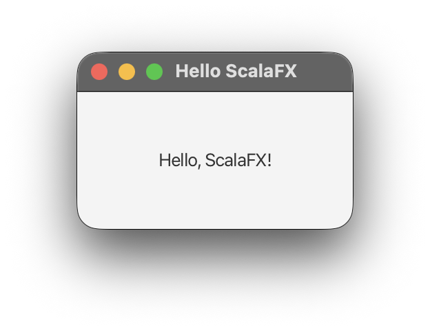

# ScalaFX

[](https://github.com/scalafx/scalafx/discussions)

[](https://github.com/scalafx/scalafx/actions/workflows/scala.yml)
[](https://central.sonatype.com/artifact/org.scalafx/scalafx_3)
[](https://javadoc.io/doc/org.scalafx/scalafx_3)
[](LICENSE.txt)

ScalaFX is a UI DSL written within the Scala Language that sits on top of JavaFX. This means that every ScalaFX
application is also a valid Scala application. By extension, it supports full interoperability with Java and can run
anywhere the Java Virtual Machine (JVM) and JavaFX are supported.

Have a question or an idea? Join us in [ScalaFX Discussions](https://github.com/scalafx/scalafx/discussions).

## Quick Start

ScalaFX binaries are published in the Maven Central repository as
[org.scalafx:scalafx_3](https://central.sonatype.com/artifact/org.scalafx/scalafx_3).
With SBT, add:

```scala
libraryDependencies += "org.scalafx" %% "scalafx" % "27.0.0-R39"
```

ScalaFX 27 requires __JDK 25 or newer__ (a [JavaFX 27 requirement](https://openjfx.io/highlights/27/)).
See [Compatibility and Versioning](#compatibility-and-versioning) for older versions.

### Hello ScalaFX

A minimal ScalaFX application in Scala 3. Save it as `HelloApp.scala` and run it with
[Scala CLI](https://scala-cli.virtuslab.org/) using `scala-cli HelloApp.scala`:

```scala
//> using dep org.scalafx::scalafx:27.0.0-R39

import scalafx.application.JFXApp3
import scalafx.scene.Scene
import scalafx.scene.control.Label
import scalafx.scene.layout.StackPane

object HelloApp extends JFXApp3:
  override def start(): Unit =
    stage = new JFXApp3.PrimaryStage:
      title = "Hello ScalaFX"
      scene = new Scene(300, 200):
        root = new StackPane:
          children = new Label("Hello, ScalaFX!")
```



For more details, including how to create a full SBT project, see
[For the Impatient](https://scalafx.org/laika/01-getting-started/01-for-the-impatient.html) on the ScalaFX website.

### Documentation

* [ScalaFX website](https://scalafx.org) - guides, starting
  with [For the Impatient](https://scalafx.org/laika/01-getting-started/01-for-the-impatient.html)
  and [Further Resources](https://scalafx.org/laika/01-getting-started/06-further-resources.html)
* [ScalaFX API (Scaladoc)](https://javadoc.io/doc/org.scalafx/scalafx_3)
* [scalafx-demos](scalafx-demos/src/main/scala/scalafx) - many small demo applications in this repository
* [Demo projects and examples](#demo-projects-and-examples) - sample projects in the ScalaFX organization

### Demo Projects and Examples

The [ScalaFX Organization page](https://github.com/scalafx) on GitHub contains several sample
projects that illustrate the use of ScalaFX.
The simplest one, and recommended to start with, is [scalafx-hello-world](https://github.com/scalafx/scalafx-hello-world).
There is also a Gradle version here: [ScalaFX-Hello-World-Gradle](https://github.com/scalafx/ScalaFX-Hello-World-Gradle).

## Build Tool Setup

<details open>
<summary><b>SBT</b></summary>

```scala
libraryDependencies += "org.scalafx" %% "scalafx" % "27.0.0-R39"
```

SBT resolves the JavaFX modules, including the platform-specific ones, through the ScalaFX dependency.
There is no need to add them explicitly.

You can find examples of SBT setup in section [Demo Projects and Examples](#demo-projects-and-examples).

</details>

<details>
<summary><b>Mill</b></summary>

If you're using [Mill](https://com-lihaoyi.github.io/mill/):

```scala
//| mill-version: 1.1.10

package build
import mill._, scalalib._

object yourProject extends ScalaModule {
  def jvmId = "temurin:25" // JavaFX 27 requires JDK version >= 25
  def scalaVersion = "3.7.3"

  // Add dependency on JavaFX libraries
  val javaFxVersion = "27"
  val scalaFxVersion = "27.0.0-R39"
  val javaFxModules = List("base", "controls", "fxml", "graphics", "media", "swing", "web")

  def mvnDeps = Seq(
    mvn"org.scalafx::scalafx:$scalaFxVersion"
  ) ++ javaFxModules.map(mod => mvn"org.openjfx:javafx-$mod:$javaFxVersion")
}
```

Unlike SBT, Mill does not resolve the platform-specific JavaFX modules through the ScalaFX dependency,
so the JavaFX modules are listed explicitly.

You can find a sample ScalaFX Mill project here: [scalafx-millproject](https://github.com/rom1dep/scalafx-millproject)

</details>

<details>
<summary><b>Gradle</b></summary>

Example of `build.gradle`:

```groovy
plugins {
    id 'scala'
    id 'application'
    id 'org.openjfx.javafxplugin' version '0.1.0'
}

repositories {
    mavenCentral()
}

javafx {
    version = "27"
    modules = ['javafx.controls', 'javafx.media']
}

dependencies {
    implementation 'org.scala-lang:scala3-library_3:3.3.8'
    implementation 'org.scalafx:scalafx_3:27.0.0-R39'
}

application {
    mainClass = 'hello.ScalaFXHelloWorld'
}
```

A complete sample Gradle project can be found in [ScalaFX-Hello-World-Gradle](https://github.com/scalafx/ScalaFX-Hello-World-Gradle).

</details>

## Compatibility and Versioning

### Compatibility of Recent Versions

| ScalaFX                   | JavaFX  | Minimum JDK | Scala               |
|---------------------------|---------|-------------|---------------------|
| `27.0.0-R39`              | 27      | 25          | 3.3+, 2.13, 2.12    |
| `26.0.0-R38`              | 26      | 24          | 3.3+, 2.13, 2.12    |
| `25.0.2-R37`              | 25      | 23          | 3.3+, 2.13, 2.12    |
| `24.0.2-R36`              | 24      | 22          | 3.3+, 2.13, 2.12    |
| `23.0.1-R34`              | 23      | 21          | 3.3+, 2.13, 2.12    |
| `22.0.0-R33`              | 22      | 17          | 3.3+, 2.13, 2.12    |

Each row shows the last release for that JavaFX version. Details for every release are in the [notes](notes) folder.

### What is in the version number

The ScalaFX version number has two parts. The first part corresponds to the latest JavaFX version it was tested with. The
second part is an incremental release number. For instance, version `27.0.0-R39` means that it was tested with JavaFX
version `27` and that it is the 39th release of ScalaFX.

## Development Snapshots

Snapshot releases are published to the
[Maven Central snapshots repository](https://central.sonatype.com/repository/maven-snapshots/org/scalafx/).
To use a snapshot build, add the Central snapshots resolver to your SBT configuration:

```scala
resolvers += Resolver.sonatypeCentralSnapshots
```

For other build tools, add `https://central.sonatype.com/repository/maven-snapshots/` as a Maven repository.

## Getting Help and Community

**[ScalaFX Discussions](https://github.com/scalafx/scalafx/discussions) is the main place for the ScalaFX community.**
Use it to ask questions, share ideas, show your projects, and get announcements. Questions asked there are seen by
the maintainers and other users, and the answers stay searchable for everyone.

* **Questions, ideas, and help** - [ScalaFX Discussions](https://github.com/scalafx/scalafx/discussions)
* **Bug reports and feature requests** - [ScalaFX Issue Tracker](https://github.com/scalafx/scalafx/issues).
  If you are not sure whether something is a bug, start a discussion first.
* **Other channels** - [ScalaFX on StackOverflow](https://stackoverflow.com/questions/tagged/scalafx)
  and the [ScalaFX Users Group](https://groups.google.com/forum/#!forum/scalafx-users)

We ask everyone to follow the [Typelevel Code of Conduct](https://typelevel.org/code-of-conduct/) in all ScalaFX
community spaces: GitHub Discussions, issues, pull requests, the mailing list, and meetups.

## Contributing

Contributions are welcome! See [CONTRIBUTING.md](CONTRIBUTING.md) for how to build ScalaFX from source, the project
structure, coding guidelines, and how to submit pull requests.

## License, Authors, and Credits

This software is licensed under the BSD 3-Clause License (BSD-3-Clause).
The License text for this software can be found in [LICENSE.txt](LICENSE.txt) in the root folder of the project.

ScalaFX was originally created by Stephen Chin, Java Champion, Oracle JavaOne
program chair; and Sven Reimers, a member of the Netbeans Dream Team.

The most up to date list of contributors to the project can be found on the
[Contributors](https://github.com/scalafx/scalafx/graphs/contributors) page.
